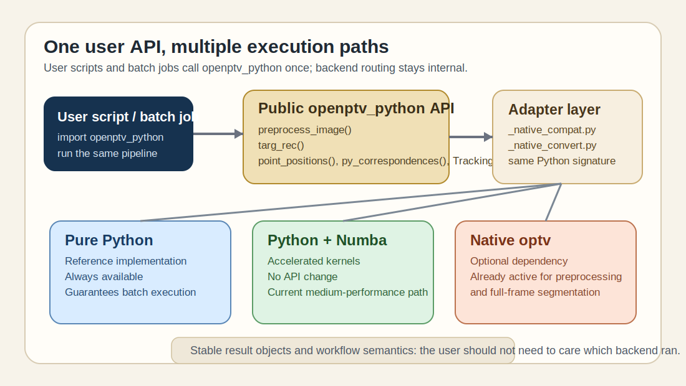
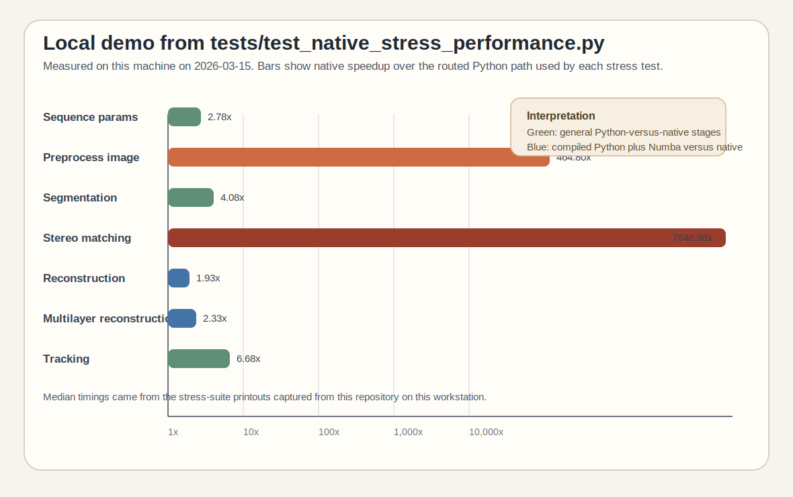

# Unified Python API Across Python, Numba, and optv

This page explains the backend model that `openptv-python` is moving toward:
one public Python API for the user, with execution routed internally to pure
Python, Python plus Numba, or native `optv` when available.

The important user-facing contract is simple:

- the script imports `openptv_python`, not `optv`
- the same Python calls should work with and without `optv` installed
- native acceleration is an implementation detail, not a second API surface



## How the API is unified today

The repository already has the basic adapter structure needed for a transparent
backend model:

- optional native feature detection lives in `openptv_python/_native_compat.py`
- Python-to-native object conversion lives in `openptv_python/_native_convert.py`
- public runtime entry points keep their Python signatures and decide internally
  whether to call Python or native implementations

Today, transparent native delegation is already active for two high-value entry
points:

- `openptv_python.image_processing.preprocess_image()`
- `openptv_python.segmentation.targ_rec()`

The rest of the 3D-PTV pipeline is already callable from Python without native
bindings, and the stress suite shows that several later stages also have native
parity paths available:

- reconstruction via `openptv_python.orientation.point_positions()`
- correspondence search via `openptv_python.correspondences.py_correspondences()`
- tracking orchestration via `openptv_python.tracking_run.TrackingRun`

That split is exactly what we want for batch jobs:

1. one Python script controls the workflow
2. pure Python remains the guaranteed fallback path
3. Numba accelerates selected kernels automatically
4. `optv` can be used underneath the same API when installed

## Why `tests/test_native_stress_performance.py` matters

The best executable description of this backend strategy is
`tests/test_native_stress_performance.py`.

That test module does three useful things:

1. it validates parity between Python and native paths for several stages
2. it benchmarks Python, compiled Python, and native implementations side by side
3. it demonstrates which stages already have a viable native provider behind the
   same workflow semantics

The benchmarked workloads in that file currently cover:

- sequence parameter loading
- image preprocessing
- full-frame target recognition
- stereo matching / correspondences
- point reconstruction
- multilayer point reconstruction
- short-sequence tracking

## Demo from this machine

The figure below was generated from a real run on this machine on March 15,
2026 using:

```bash
/home/user/Documents/GitHub/openptv-python/.venv/bin/python -m pytest -q -s tests/test_native_stress_performance.py
```

The chart shows native speedup over the routed Python path used by the test:

- for preprocessing, segmentation, stereomatching, and tracking this is Python
  versus native
- for reconstruction workloads this is compiled Python plus Numba versus native



## Measured median timings

| Workload | Python or routed Python path | Native path | Speedup shown in figure |
| --- | ---: | ---: | ---: |
| Sequence params | 0.000029 s | 0.000010 s | 2.78x |
| Preprocess image | 2.263711 s | 0.004870 s | 464.80x |
| Segmentation | 0.012110 s | 0.002967 s | 4.08x |
| Stereo matching | 23.990435 s | 0.003137 s | 7646.98x |
| Reconstruction | 0.012397 s | 0.006419 s | 1.93x |
| Multilayer reconstruction | 0.015707 s | 0.006754 s | 2.33x |
| Tracking | 2.247133 s | 0.336165 s | 6.68x |

For the two reconstruction workloads, the same stress test also reported the
benefit of the current compiled Python path over the older per-point Python loop:

- reconstruction: compiled Python was 63.01x faster than legacy Python
- multilayer reconstruction: compiled Python was 54.87x faster than legacy Python

This is the key architectural message of the page: the repository does not need
two user APIs to get performance. It needs one stable Python API with multiple
internal execution paths.

## What this means for the roadmap

The test results support a practical backend policy:

1. keep Python as the orchestration and scripting surface
2. preserve current public function signatures so scripts and GUI code do not
   care which backend is active
3. keep the pure Python implementation as the reference behavior
4. continue using Numba for the medium-performance path
5. route additional heavy stages to `optv` or future compiled kernels behind
   the same API

In other words, users should be able to write one batch script and get:

- correct execution with no native dependencies installed
- better throughput when Numba is active
- still better throughput when `optv` is installed and the operation has a
  native provider

That is the unifying API story already visible in the codebase and demonstrated
by the stress suite.